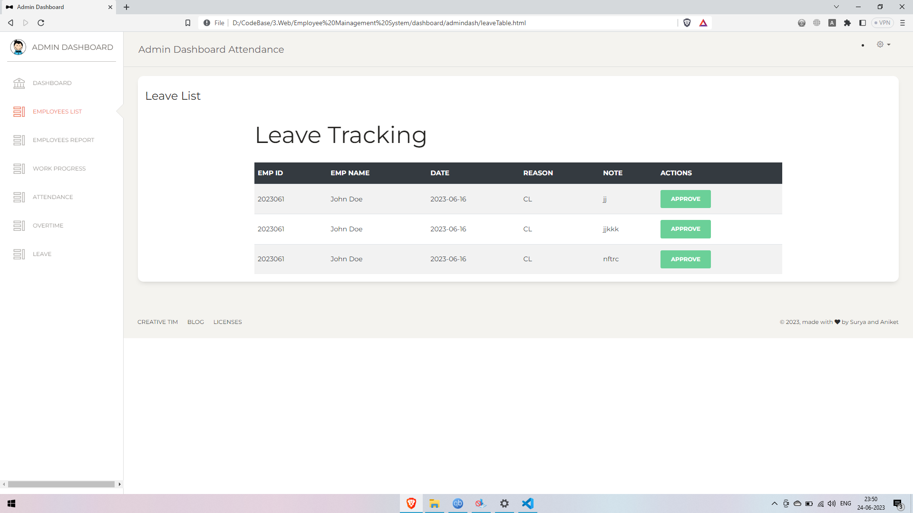

# Employee Management System

The Employee Management System is a simple and efficient solution for managing employees within an organization. It utilizes a range of technologies to provide a seamless user experience and efficient data storage.

## Technology Stack

The system is built using the following technologies:

1. JavaScript
2. HTML
3. CSS
4. IndexedDB
5. Storage API

## Description

The Employee Management System is designed with a well-structured HTML and CSS foundation, incorporating Bootstrap for enhanced styling. JavaScript is responsible for handling animations and serving as the backend. The Storage API enables persistent storage of the required data, while IndexedDB provides efficient database storage and operations. It's important to note that the documentation file must be executed first, as it loads the necessary data into the storage API (local storage). The system is user-friendly and straightforward to navigate.

## Installation / Setup / Usage

To utilize the Employee Management System, follow these steps:

1. Ensure you have a Chrome or Chromium-based browser installed.
2. Download the project files.
3. Extract the ZIP archive.
4. Run `enabler.html` located in the documentation folder.
5. Click on Button 1 and Button 2.
6. Close the page and launch `index.html`.
7. You're all set!

## Login Credentials

- Admin Page:  
  Username/Password: admin/admin

- Normal Sign-In:  
  Username/Password: 2023061/password123, 2023062/securepass

## Screenshots

### Landing Page

### Employee Dashboard

### Punch with Image

### Admin Page

### Miscellaneous Pages

Thank you for taking the time to view this project.

Nikhil Singh
